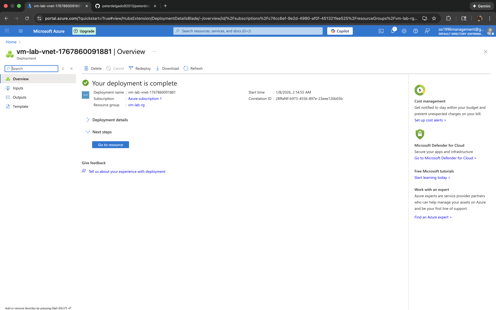
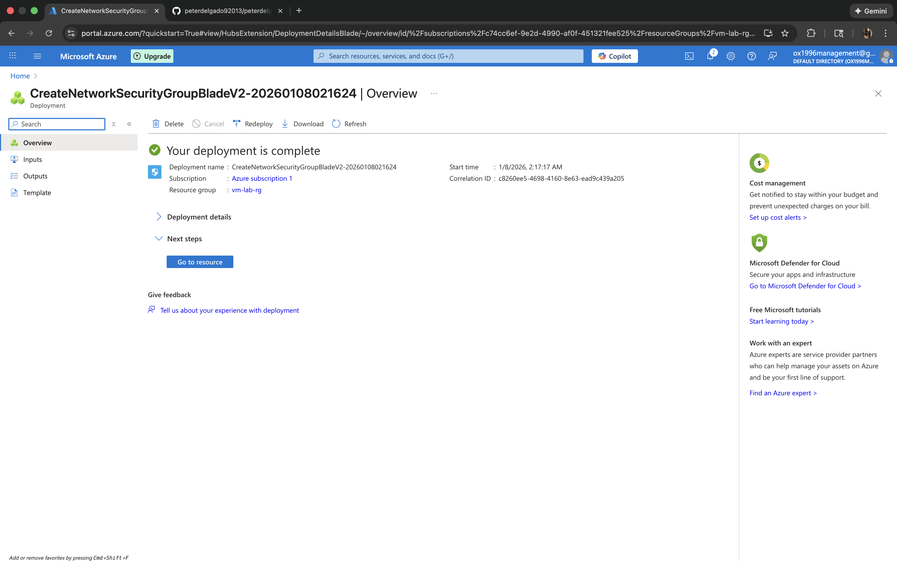
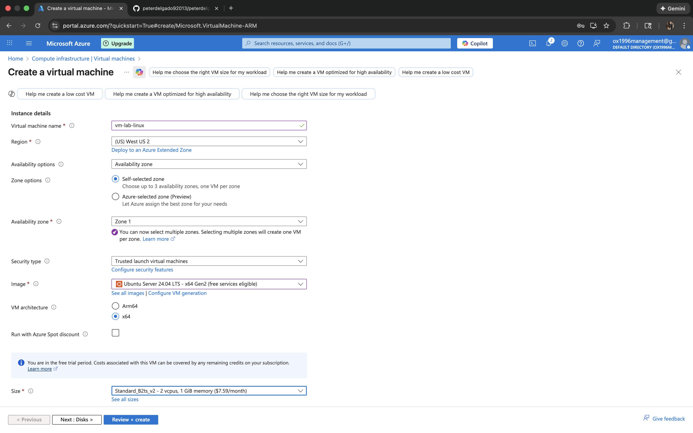
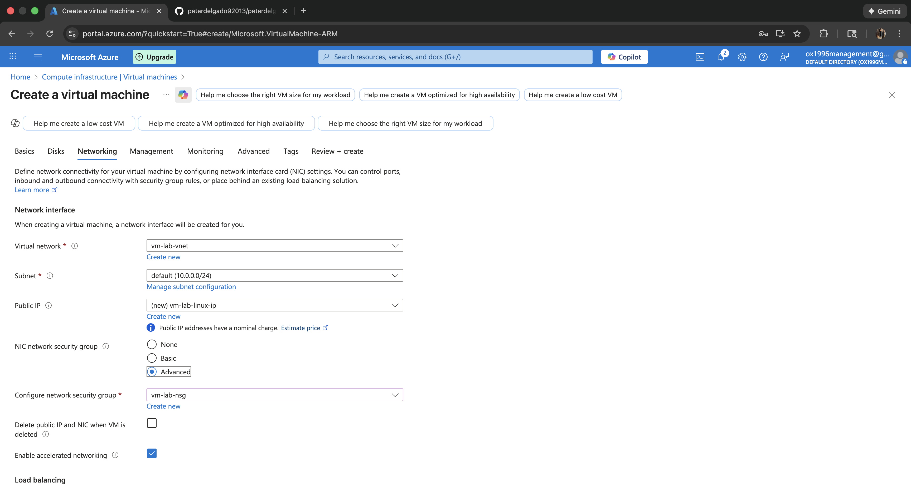
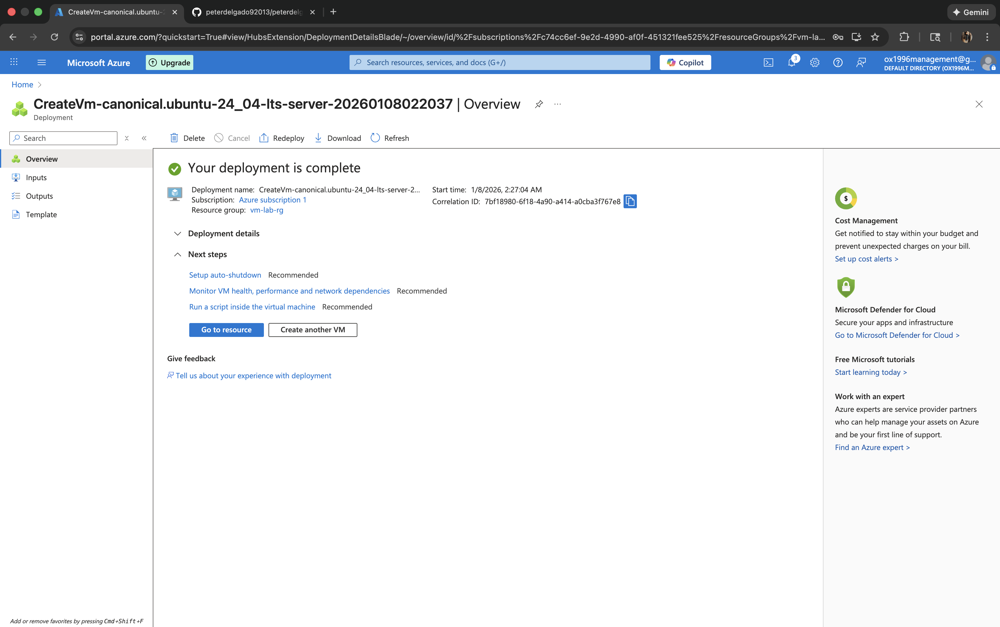
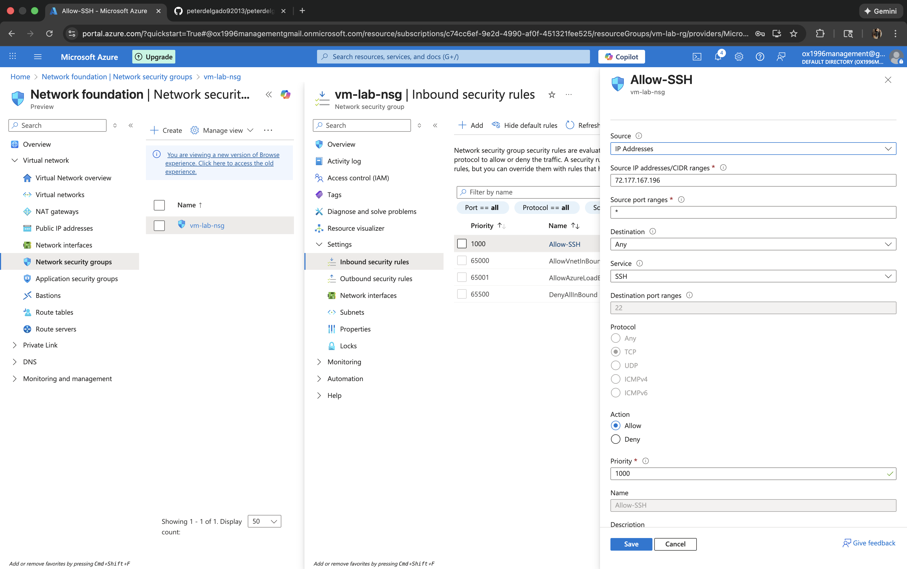
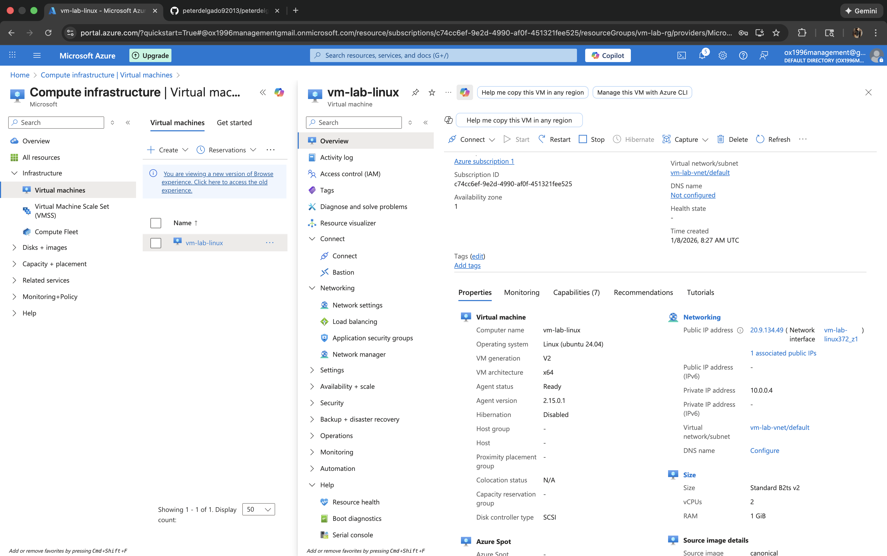
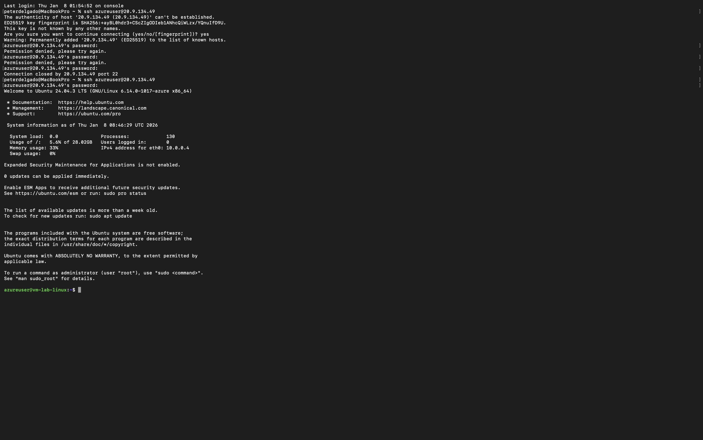
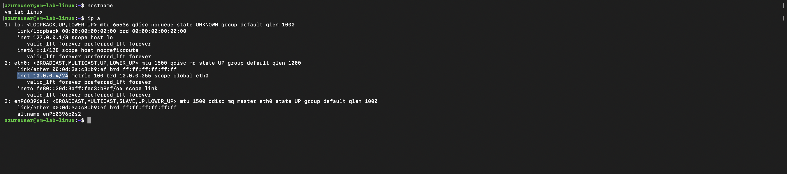

# Azure Virtual Machine (VM – Virtual Machine) Deployment

# Azure Virtual Machine Deployment

## Project Overview

This project demonstrates the deployment and configuration of an Azure Virtual Machine using secure networking best practices. I created and configured core Azure resources including a Resource Group, Virtual Network, Network Security Group, and a Linux Virtual Machine. I also verified secure SSH access and validated network behavior to ensure the environment was functioning correctly.

---

## Architecture Overview

- Resource Group to organize all Azure resources  
- Virtual Network for network isolation and traffic control  
- Network Security Group to restrict and allow inbound traffic  
- Linux Virtual Machine accessed securely via SSH  

---

## Step-by-Step Deployment

### Step 1: Create Resource Group
I created a dedicated resource group to logically organize all resources related to this project.

---

### Step 2: Create Virtual Network
I created a virtual network to provide isolated networking for the virtual machine.

---

### Step 3: Create Network Security Group
I created a Network Security Group (NSG) to control inbound and outbound traffic.

---

### Step 4: Configure Virtual Machine Basics
I configured the virtual machine basics including name, region, image, and size.

---

## Step 5: Configure VM Networking
I attached the virtual machine to the virtual network and applied the Network Security Group.

---

## Step 6: Deployment Successful
I reviewed and completed the deployment, confirming the virtual machine was successfully created.

---

## Step 7: Configure NSG SSH Rule
I verified that the Network Security Group allowed SSH traffic securely.

---

---

### Step 8: Establish SSH Connection
I connected to the virtual machine using SSH to verify secure access.

---

### Step 9: Verify Hostname and IP Address
I verified the virtual machine’s hostname and private IP address using command-line tools.

---

### Step 10: Stop Virtual Machine
I safely stopped the virtual machine to prevent unnecessary resource usage and cost.

---

## What I Learned

- How to deploy and manage Azure Virtual Machines  
- How Azure Virtual Networks and Network Security Groups work together  
- How to secure access using SSH  
- How to validate network connectivity using Linux command-line tools  
- How to document cloud projects clearly using GitHub  

---

## Skills Demonstrated

- Microsoft Azure  
- Virtual Machine Deployment  
- Azure Virtual Networking  
- Network Security Groups (NSGs)  
- Secure SSH Access  
- Linux Command Line  
- Cloud Documentation with GitHub  

---

## Summary

This project demonstrates my ability to design, deploy, secure, and validate Azure virtual machine infrastructure using industry best practices. I implemented secure networking, controlled access using Network Security Groups, verified connectivity through SSH, and documented the entire process in a professional and structured manner.
